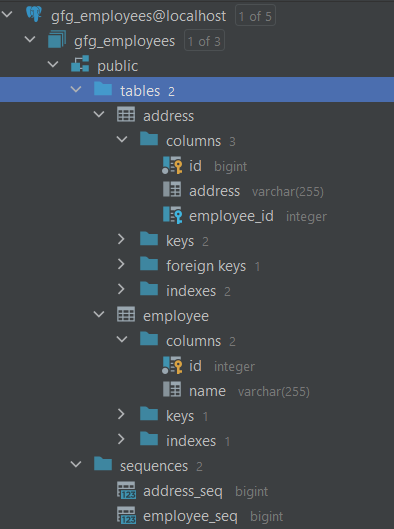

# Geeks For Geeks

## Spring Boot transaction management

### Reference Guide

Geeks For Geeks :
[Spring Boot – Transaction Management Using @Transactional Annotation](https://www.geeksforgeeks.org/spring-boot-transaction-management-using-transactional-annotation/)

### Maven dependencies:

* Spring Web
* Spring Data JPA
* PostgreSQL in place of MySQL db

The @Transactional annotation is used in EmployeeService::addEmployee

Web endpoint to demonstrate the transactional method is "localhost:8080/api/employee/addWithError"

The sample POST request is saved in [web_requests.http](intellij_http/web_requests.http)

### Summary of the database structure.

## Data Transfer Objects

### Reference Guide

Geeks For Geeks :
[Spring Boot – Map Entity to DTO using ModelMapper](https://www.geeksforgeeks.org/spring-boot-map-entity-to-dto-using-modelmapper/)

Web endpoints:

* POST .../api/user/create
* GET .../api/user/{userId}

## Data validation

Geeks For Geeks :
[Spring Boot – Validation using Hibernate Validator](https://www.geeksforgeeks.org/spring-boot-validation-using-hibernate-validator/)

The jakarta.validation.constraints.* annotations are used at the model level.
@Valid annotation used to apply validation to arguments at the controller inputs.
